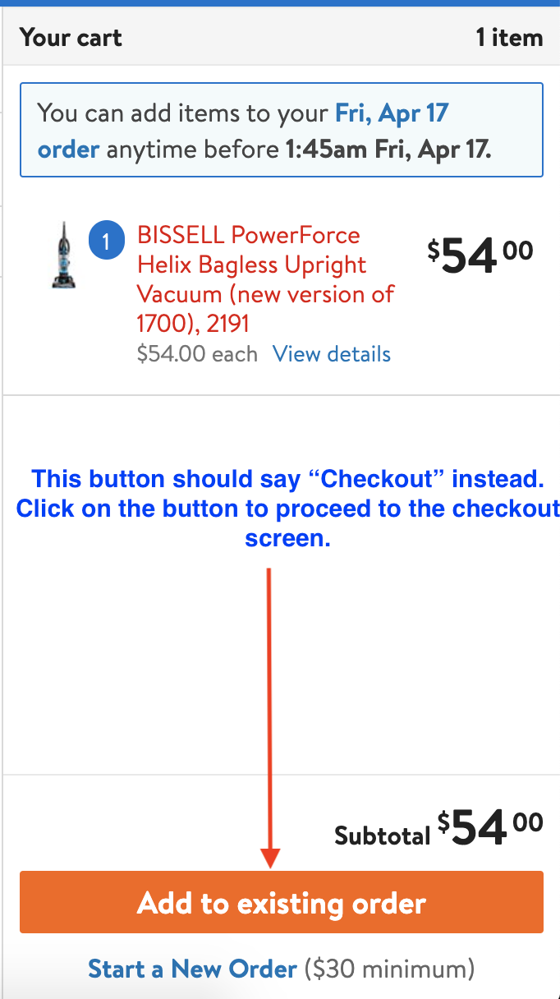
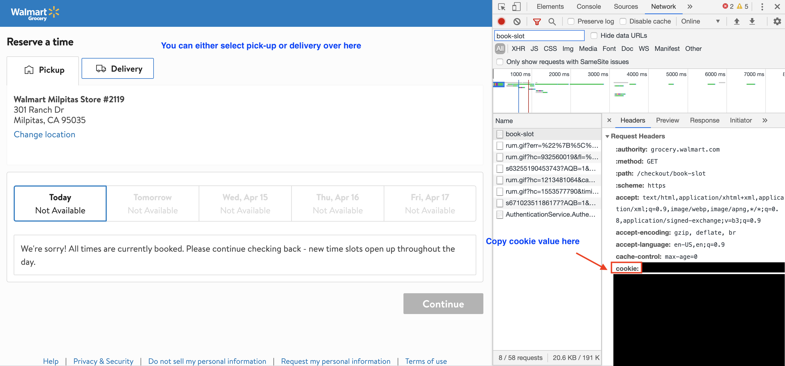
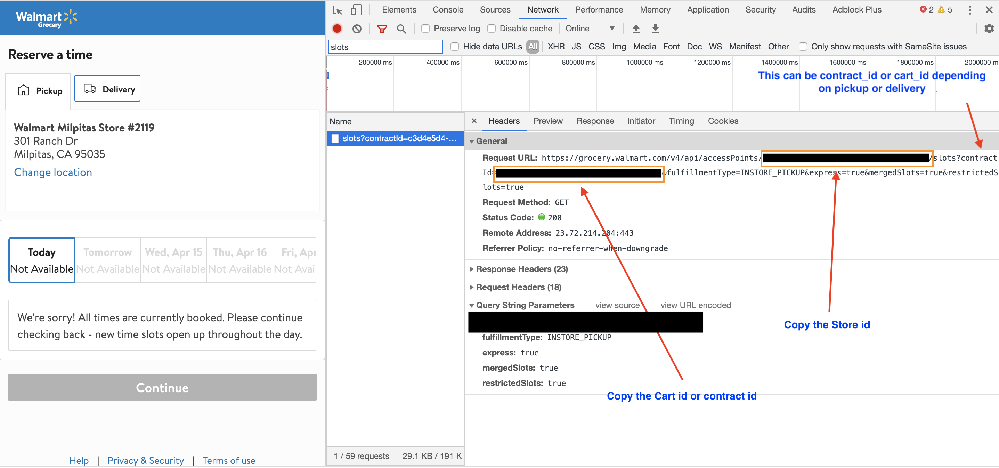
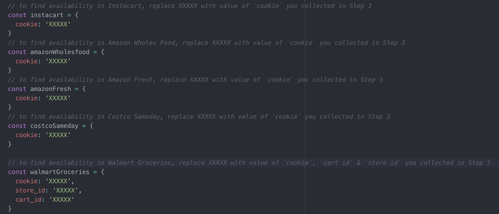

# Delivery Finder
# Mission: To help people stay in the home to minimize the spread of COVID-19 in the USA!

## Problem:
**People are getting frustrated when they don't find grocery delivery window available for the online orders. So they have two options - (1) Step out of the home to buy grocery or (2) Keep checking MANUALLY 24/7 to get lucky to find available delivery window.**

## Solution:
**Run this script, which will check the availability of delivery window of many retailers every minute and alert you as soon as it finds one. Currently this script checks available delivery windows for these retailers:**

|   |  |  | 
| ------------- | ------------- | ------------- | ------------- |


<hr>


This is an effort to help people to get their groceries in this difficult time of COVID-19. This script helps you to find a delivery window of many grocery retailers. The finder will alert (you will hear this [Beep sound](https://clyp.it/fjrsqftl) as an alert) you when it finds an availability window is open.
*This is a barebone (unoptimized) script - `a quick & dirty hack`. If you are a developer, then feel free to send a PR to improve it*

# How to use this finder
### If you have any difficulty in setting up, then send me email at finder@altmails.com

## Step 0

*a)* Install `npm` and `nodejs` -
To do so, go to https://nodejs.org/en/ and download any version of the binary, that will be used for installing `node` as well as `npm`. Then double click the downloaded binary and follow the instructions to install `npm` as well as `node` . To confirm the installation, open your terminal.app window and run `node -v` if that outputs a version number, then you are good to move forward.

*b)* Download (or clone) this repo by clicking the green "Clone or Download" button shown above. If you have downloaded, then unzip the downloaded folder (`delivery-finder-master`) and rename the folder to `delivery-finder`

## Step 1
Assuming you are on Mac OS, so open a terminal window and create a folder, let's say, `covid19`
```
$ mkdir covid19
$ cd covid19
```
Move the downloaded folder `delivery-finder`  (as done in Step0-b above) in `covid19` folder

## Step 2
<hr>

## *If you want to find availability in Instacart or Costco SameDay then follow these three steps*

### Step 2.1
> On Google Chrome browser - for instacart, open https://instacart.com or for Costco SameDay, open https://sameday.costco.com and login to your account. Take your time to add all your items in the shopping cart. Once you have all your desired items in the cart, then move to `Step 3`

### Step 2.2
> Go to your cart page


### Step 2.3
> On the checkout page, if there is no availability window, then you may see this page, then


> **Move to step 3 now**

<hr>

## *If you want to find availability in Amazon Whole Foods then follow these three steps*

### Step 2.1
> On Google Chrome browser - open https://amazon.com (on Google Chrome browser) and take your time to add all your items in the shopping cart of Whole Foods (NOT Amazon Fresh). Once you have all your desired items in the cart, then move to `Step 3`

### Step 2.2
> Go to your Whole Foods Market cart page


### Step 2.3
> On the checkout page, if there is no availability window, then you may see this page. Then `right click` anywhere on this page and select `inspect` which will open a developer tool bar as shown below


> **Move to step 3 now**

<hr>

## Step 2
<hr>

## *If you want to find availability in Walmart Groceries for pickup or Delivery then follow these three steps*

### Step 2.1
> On Google Chrome browser - for walmart groceries, open https://groceries.walmart.com and login to your account. Take your time to add all your items in the shopping cart. Once you have all your desired items in the cart.

### Step 2.2
> Go to the carts page and select checkout.


### Step 2.3
> On the checkout page, if there is no availability window, then you may see this page. Then `right click` anywhere on this page and select `inspect` which will open a developer tool bar as shown below.

> Follow steps in the images to get the cookie, store id and cart id information.




> **Move to step 3 now**

<hr>

## Step 3
*IMPORTANT* From the previous step you must have value of `cookie`, save it in any text editor (will be used later).


## Step 4
*IMPORTANT* - Make sure you don't close the retailer's checkout page (from where you collected the cookie) ever while this finder is running. So let the page remain opened.

## Step 5
Go to `delivery-finder` folder where the finder codebase is residing. Below is the directory structure of the code:

```
delivery-finder
│   finder.js           // Entry point to our codebase    
│
config
│   │   auth.js         // File containing Auth config for the stores
│   │   stores.js       // Constants file containing all the store names
│   
│   .eslintrc           // ESLint config file for the project
```

## Step 6
Navigate to the `delivery-finder` folder and then go to `config/auth.js`. 

Open `auth.js` file in any editor of your choice. You will find configuration for different retailers. For your desired retailer(s), change the value of string `XXXXX` in `cookie: 'XXXXX'` to your desired retailer(s)'s cookie value, that you have collected in step2 above. However for `Walmart`, you would need to add two more pieces of information. They are `store_id: XXXXX` and `cart_id: XXXXX`.



## Step 7
Go to the terminal window at `/covid19/delivery-finder` folder
`You will have to open separate terminal windows for finding each retailer's availability window`
when you are at `/covid19/delivery-finder` folder, follow the step below:

```
For instacart, run:
$ node finder.js -instacart
```
OR
```
For Amazon Whole Foods, run:
$ node finder.js -amazonwholefoods
```
OR
```
For Costco Sameday, run:
$ node finder.js -costcosameday
```
OR
```
For Walmart Pickup, run:
$ node finder.js -walmartgroceriespickup
```
OR
```
For Walmart Pickup, run:
$ node finder.js -walmartgroceriesdelivery
```
OR
```
NOT SUPPORTED YET
For Amazon Fresh, run:
$ node finder.js -amazonfresh
```

**An example**


In your output, if you see the following then you are all set.
```
** SUCCESS ** YOUR COOKIE VALUE OF instacartCookie IS CORRECT, NOW LET THE FINDER FIND AND ALERT YOU. MAKE SURE YOU KEEP THIS TERMINAL WINDOW & CHECKOUT PAGE OPEN WITH YOUR LAPTOP SOUND AT MAX
```

If you see any error, then it means you need to correctly put the values of cookie for that retailer

That's all!!

## What to expect next.
Leave your computer plugged in and don't close it (let it remain connected to the internet). You may leave it in the low power mode if you wish. Let the terminal window remain opened and you may see progress there every minute. This finder will keep checking the availability window every minute, you may hear a [Beep sound](https://clyp.it/fjrsqftl) when it finds an availability. Then you just go to the opened retailer's checkout page (as mentioned in step 2) and refresh it. You may see the availability window. *Remember there is no guarantee that this script will find a delivery window, unless retailer opens it (common sense) Sometime if you don't act fast enough then even if script alerted the delivery window, but you delayed in taking action, then the window may disappear) :wink:*

## Any developer wants to contribute?
You are welcome to send the PR

## Thanks to these folks who contributed in the development of this script for supporting the cause.
1. [dishant](https://github.com/dishant)
1. [parikhv15](https://github.com/parikhv15)


## Disclaimer
The author doesn't take any responsibility for any situation that may be the result of running this script. Please use it at your own risk.
